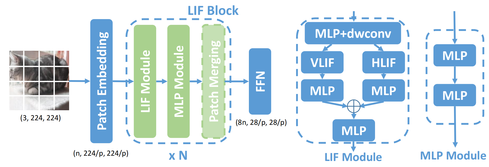

# Contents

- [Contents](#contents)
    - [SNN-MLP Description](#snn-mlp-description)
    - [Model architecture](#model-architecture)
    - [Dataset](#dataset)
    - [Usage](#usage)
    - [Result](#result)

## [SNN-MLP Description](#contents)

 To efficiently communicate between tokens, we incorporate the mechanism of LIF neurons into the MLP models, and achieve better accuracy without extra FLOPs.

[Paper](https://arxiv.org/pdf/2203.14679.pdf): Wenshuo Li, Hanting Chen, Jianyuan Guo, Ziyang Zhang, Yunhe Wang. Brain-inspired Multilayer Perceptron with Spiking Neurons. arxiv 2203.14679.

## [Model architecture](#contents)

A block of SNN-MLP is shown below:



## [Dataset](#contents)

Dataset used: [ImageNet2012](http://www.image-net.org/)

- Dataset size 224*224 colorful images in 1000 classes
    - Train: 1,281,167 images  
    - Test: 50,000 images
- Data format: jpeg
    - Note: Data will be processed in dataset.py


## [Usage](#contents)

```bash

# infer example
  bash ./train_scripts/test.sh

# train example
  bash ./train_scripts/train_snnmlp_t.sh # 8 gpus

# get throughput
  bash ./train_scripts/get_throughput.sh

```

## Result

|Model|Params (M)|FLOPs (B)|Top-1|Download URL|
|-|-|-|-|-|
|SNN-MLP-T|28.3|4.4|81.9|[[ckpt]](https://github.com/huawei-noah/Efficient-AI-Backbones/releases/download/snnmlp/snnmlp_tiny_81.88.pt) & [[log]]( https://github.com/huawei-noah/Efficient-AI-Backbones/releases/download/snnmlp/snnmlp_tiny_81.88.log)|
|SNN-MLP-S|49.7|8.5|83.3|[[ckpt]](https://github.com/huawei-noah/Efficient-AI-Backbones/releases/download/snnmlp/snnmlp_small_83.30.pt) & [[log]]( https://github.com/huawei-noah/Efficient-AI-Backbones/releases/download/snnmlp/snnmlp_small_83.30.log)|
|SNN-MLP-B|87.9|15.2|83.6|[[ckpt]](https://github.com/huawei-noah/Efficient-AI-Backbones/releases/download/snnmlp/snnmlp_base_83.59.pt) & [[log]]( https://github.com/huawei-noah/Efficient-AI-Backbones/releases/download/snnmlp/snnmlp_base_83.59.log)|

